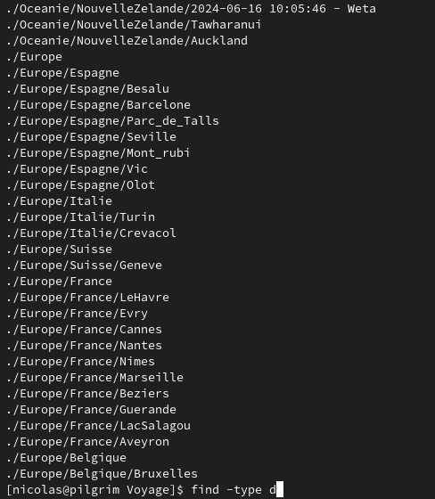
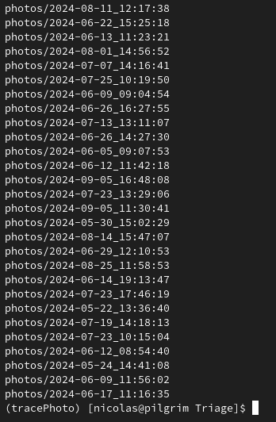
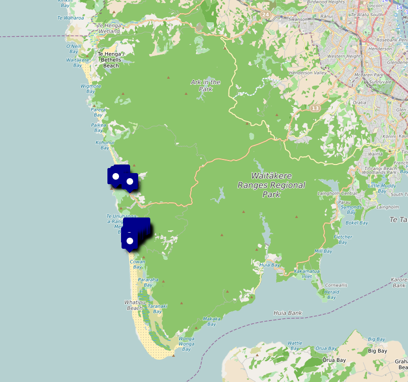
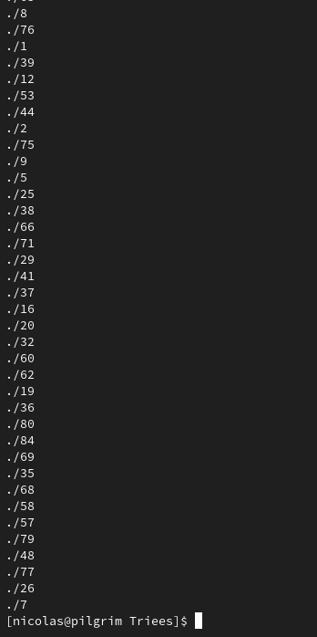
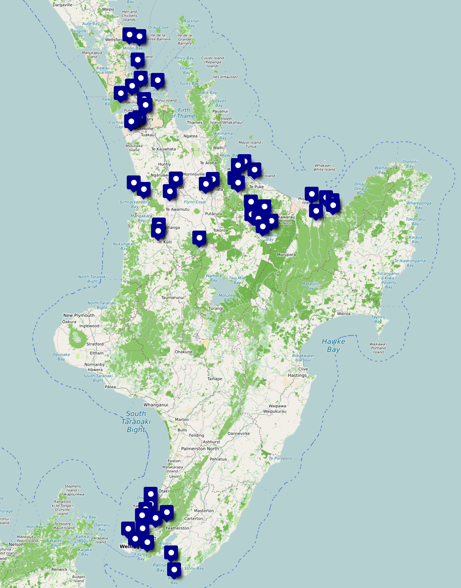
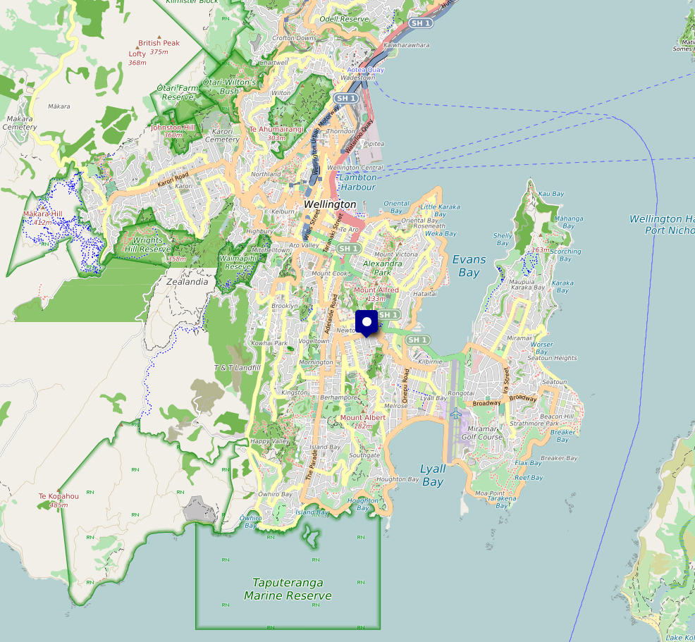

# Classification de mes photos

Voici ma serie d'algorithme afin de classer mes photos par lieux

## Contexte 

L'idée de faire cet algorithme me vient de mon voyage en Nouvelle Zélande ou je prends des milliers de photos. Sauf que je n'ai pas le temps de les trier au fur et à mesure. 
Donc je me retrouve à trier des gros blocs de photos et honnetement j'ai la flemme de le faire. 

Au cours des années j'ai vite compris qu'un ordinateur est un bon outil pour automatiser des taches et il est bon d'utiliser les bons outils pour son travail. Si on ne plante pas des clous avec la main il y a une raison.

## Comment grouper mes photos ?

Eh oui ! Bonne question comment organiser des milliers de photos.

Pour ma part, j'ai decider de les grouper par contient / pays / lieux.
J'ai un dossier `PhotoVoyage` ou dedans j'ai `Oceanie` `Amerique` et `Europe`.
Dans chaqu'un de ces dossiers j'ai les pays que j'ai visiter. Dans `Europe` j'ai `France`, `Espagne`, ...
Puis dans `France`, je vais avoir `Nantes`, `Paris`, ...
Et dans chaqu'un de ses dossiers je peux avoir d'autre plus precis



## Par date ?

Au début je me suis dit que j'allais les trier par instant ou j'ai pris la photo (sa date).
L'algorithme est assez simple.

1. On parcours toutes les photos
2. On extrait la date de la prise
3. On trie tout les photos par date
4. On parcours la liste de photos du plus ancien au plus récent
5. Si il y a plus de 2 heures entre deux photos alors elle ne sont pas dans le même groupe

2 heures c'est assez arbitraire mais je me suis dit que si je ne prends pas de photo pendant 2 heures j'ai surement changé de lieu. J'ai fais plusieurs essaies avant de trouve ce chiffre.

Easy !

Premièrement, il faut savoir comment recupèrer la date de la prise de la photo. 
Les photos contiennent tout un tas de metadata (temperature exterieur, coordonnée GPS, marque de l'appariel photo, horodatage, ...). Il y a differents format mais celui qui nous intéresse est `Exif`. Il contient au moins l'horodatage et les cordoonées GPS des photos.

Pour récuperer les données en Python, il existe une petite librairie qui permet de le faire. (https://exif.readthedocs.io/en/latest/index.html)

Le resultat est dans [classement_par_date.py](classement_par_date.py)

Rien de compliqué dans ce script, on respecte l'algorithme citée plus haut. Simple et efficace.

Voici le résultat : 



C'est bien mais il y a encore pas mal de travail manuel dérrière et si je retourne sur un même lieux une deuxieme fois ca me fera un autre dossiers.

## Par coordonnées GPS ?

Comme je disais plus haut, les données `Exif` stockent également les données GPS de la photo. Il faut bien entendu que l'appareil qui prends la photo soit capable de les fournir (Spoiler : ça sera un nouveau problème)

Je m'étais fait un petit script qui permettait d'extraire les coordonnées et les sortir au format `GPX`. Ca m'a donnée un idée de comment grouper mes photos

.

Sur cette carte on voit bien deux regions distincts. La plage de Piha au nord et celle de Karekare au sud - Pour les cinéphile, c'est sur cette plage qu'a été tourné `La leçon de piano` -

Il me faut donc trouver un algo qui permet de les regrouper, j'ai fais plein d'essai et tester beaucoup de chose avant de me rendre à nouveau compte qu'il ne faut pas réinventer la roue. Il existe une librairie de clustering qui reponds exactement à mes besoins (https://scikit-learn.org/stable/modules/generated/sklearn.cluster.DBSCAN.html)

LA fonction que l'on utilisera est `DBScan`, cela va nous permettre de créer des clusters en fonction de la distance entre chaque photos.

Cette fonction à deux paramètre important, `eps` qui est la distance maximum entre deux données et `metric` qui la fonction choisi pour calculer la distance. Dans notre cas, ça sera la methode `haversine` (https://fr.wikipedia.org/wiki/Formule_de_haversine).

Voici le bout de code que j'utilise pour le clustering

```python
# Array numpy cast 
coordinates_list = [i.coord for i in data_images.values() if i.coord]
photo_paths = [i.path for i in data_images.values() if i.coord]

coords = np.array(coordinates_list)

eps_in_km = 4.0 
# Radians cast
eps_in_radians = eps_in_km / 6371

# Clustering by DBSCAN 
db = DBSCAN(eps=eps_in_radians, min_samples=3, metric='haversine').fit(np.radians(coords))
```
* La distance `eps` est en radians

Les deux premières lignes sont la pour séparer les données de ma liste de photos. Je veux deux listes distincts, une avec les coordonnées et l'autre avec les chemin.
On convertie ensuite le tableau de coordonnées au format de `numpy` - Librairie de calcul scientigique - pour la passer à `DBScan`. `DBScan` va créer une liste d'identifiant de cluster, la focntion de clustering va se baser sur la position dans le tableau pour pouvoir retrouver l'information initial.


DBScan decide que le cluster de la plage de Piha est `3`, mes photos de la plage sont en position 5, 12, 25, 32 alors le tableau sorti par `DBScan` aura en position 5, 12, 25 et 32 l'entier `3`.   

C'est pas forcement évidement, cela sera surement plus simple avec la fonction qui permet de rassembler toutes les informations :

```python
labels = db.labels_

# labelize photo paths
clusters = {}
for label, path, coord in zip(labels, photo_paths, coords):
  if label not in clusters:
    clusters[label] = []
  clusters[label].append(data_images[path])
  data_images[path].cluster = label
```

* `labels` : Liste des ids de mes clusters
* `photos_path` : Liste des chemins vers mes photos
* `coords` : Liste des coordonnées de mes photos


.

Tadam ! On obtient un dossier pour chaque cluster ! Est-ce que j'ai resoulu mes problèmes du groupement avec le groupement par date ? Pas vraiment, c'est encore moins compréhensible qu'avant. C'est assez compliqué à voir comme ça mais les photos sont bien groupées par endroits.

J'ai extrait les coordonées GPS du centre de chaque cluster et j'ai mis un point sur chaque cluster.


.

Le resultat n'est pas si mal que ça. Je me retrouve avec 47 clusters differents. 
Le clusters sont assez bien regroupé et ça me convient bien (`EPS` est de 4km)

Les groupes fonctionnent bien quand on est dans la campagne les esapce sont assez grands un `EPS` de 4km est suffisants mais quand on est en ville, 4km c'est trop. Du coup, je me retrouve avec un cluster de 420 photos pour la ville de Wellington.


.

C'est une evolution que j'envisage de faire. J'ai pensé à 2 solutions
* Detecter les points dans les villes et refaire une passe de DBScan. Efficace mais compliqué à mettre en place. Comment detecter si on est dans une ville ?
* Si un dossier contient un grand nombre de photo, alors on refait une passe de DBScan. Simple ! Mais j'ai certains dossiers qui contient beaucoup de photos d'une même zone. Pour Hobbiton j'ai plus de 130 photos ...

Bon, on va traiter un problème à la fois. 

### Trouver le nom des places

Une fois que j'ai fait mes clusters et que j'ai obtenu tout mes dossiers. J'enregistre dans un fichier `json` des metadata associées au cluster. J'ecris la coordonnées du centre de chaque cluster. 

Pour mon cluster 0, ça donne ça : 

```json
{"0": {"datetime": 1718253620.9124088, "centroid": [-37.85863017031631, 175.68077248580698]}}
```

Il existe des API qui permette de faire une recherche sur une carte inversée. c'est à dire on rentre des coordonnées et ça nous sort une adresse ou un lieux.

Je pense que l'API de Google Maps reponds parfaitement au besoin. Mais pour mon premier essai j'ai utilise une API d'openstreetmap (https://nominatim.openstreetmap.org/reverse)


## TODO

Chnager la sensibilité du DBScan dans les ville

Une fois que les noms des dossiers son modifié, il faut modifier les metadatas avec le nouveaux noms des dossiers